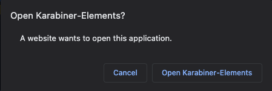
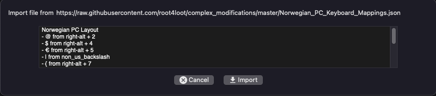
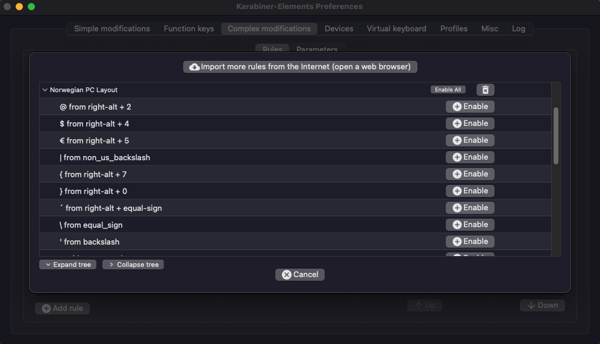
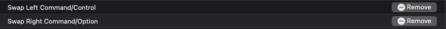
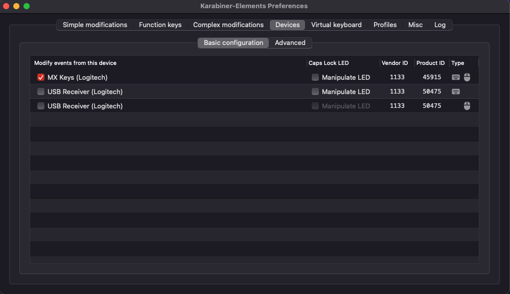

## Prerequisites

[Karabiner elements](https://karabiner-elements.pqrs.org/)

```
brew install --cask karabiner-elements
```

## Installing

#### Open (copy/paste) the following in your browser
```
karabiner://karabiner/assets/complex_modifications/import?url=https://raw.githubusercontent.com/root4loot/norwegian_karabiner_mappings/master/mappings.json
```

#### Click "Open Karabiner-Elements"   


#### Click "Import" hit Ok


#### Click "Enable All" 


#### Remove if needed


## Debugging

Make sure that your keyboard device is checked in **Devices -> Basic configuration**  


